# Lecture 2 : Image Classification

컴퓨터는 이미지를 다음과 같이 RGB의 숫자로 받아들인다.

여기서 RGB와 같은 차원을 channel이라고 부른다.

즉, 이미지는 height * width * channel 세가지 차원으로 구성된다.

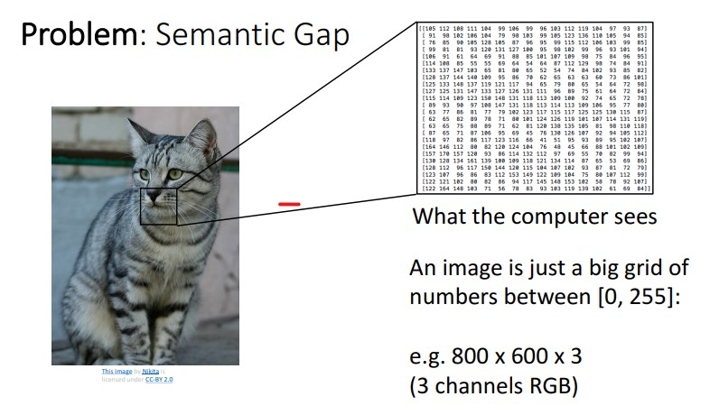

하지만 이 숫자들이 명확히 고양이를 다루고 있다고 구분 짓는 것이 어렵다. 이런 차이를 **semantic gap**이라고 한다.

직관의 차이가 있다. 컴퓨터는 그냥 이미지가 데이터화가 되었으니. 우리는 그렇게 보지를 않는다.

----

image problem을 더 애매하게 만드는 요인들

1. Viewpoiint Variation

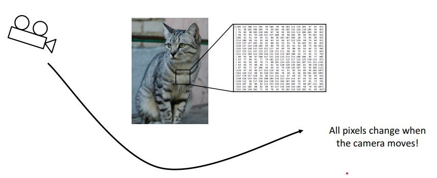

2. Intraclass Variation : 같은 종류인데 다른 것으로 인식할 수 있다.

3. Fine Grainded Categories : 비슷한 아종들 분류하는 문제

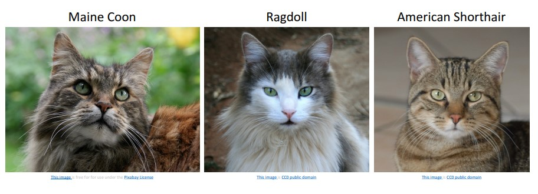

4. Background Clutter

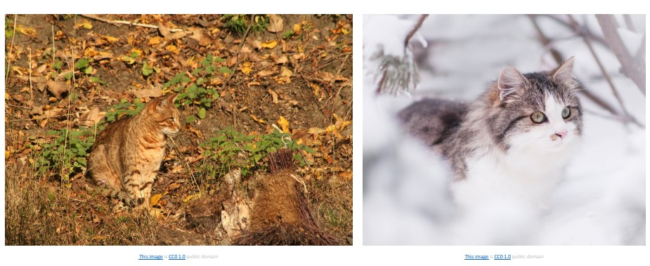

5. illumination Change : Light Prob

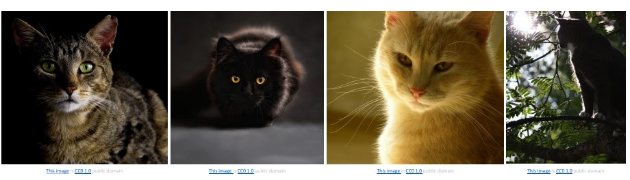

6. Deformable

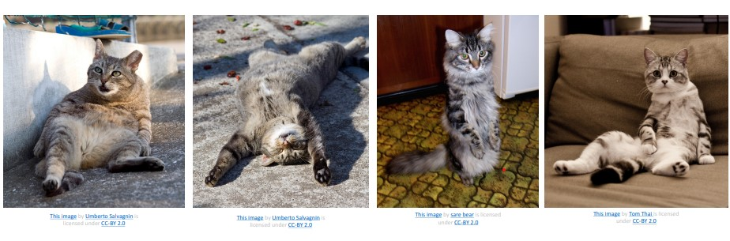

7. Occlusion : 잘 안보이는 경우

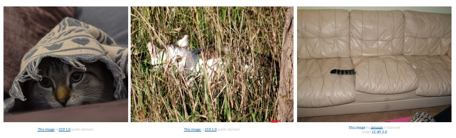

Object Classification은 computer vision 분야의 가장 기본적인 문제이다.
다른 문제를 풀 때에도 그 기반이 된다.

----

## Image Classifier

### edge detection

다 좋은데 edge만 접근 가능하다는게 문제다. 하나의 대상에 대해서만 detecting이 잘된다.

그래서 머신러닝 방식으로 접근을 시도한다.

1. image & label dataset 모은다.
2. Machine Learning을 이용해 classfier를 학습시킨다.
3. new image를 통해 classfier를 평가해본다.

크게 두가지 API를 만들게 되는데, 하나는 train, 하나는 predict이다.

train : input을 받아서 machine learning을 통해서 stastical model을 반환한다.

predict : input으로 model과 예측 대상 image를 받아서 예측한 label을 내놓는다.

Machine Learning Approach를 하면 data만 변경하면 된다. 새로운 model을 만들 필요가 없다!

----

## K-nearest Neighbor Classifier

label을 nearest training example을 이용해서 예측하는 문제이다.

K-nearest Neighbor 문제는 어디에서나 적용할 수 있는 아주 기본적인 문제이다.(building block이라고 한다.)

train은 input data를 모두 기억하고

predict는 그것을 기반으로 예측을 행한다.

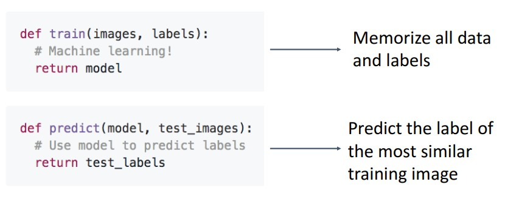

두 이미지 간의 차이를 계산하기 위해서 L1 distance를 사용하기도 한다.

각 픽셀의 숫자의 차이를 구하는 것이다.

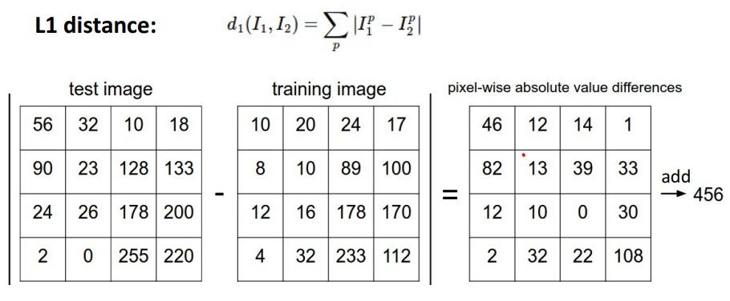

----

K-nearest Neighbor Classifier는 다음과 같이 구현하면 된다.

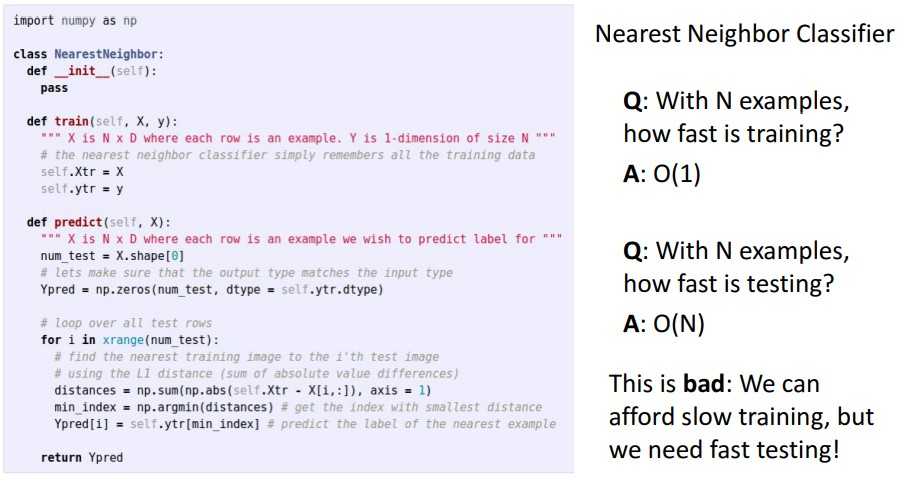

문제는 이 알고리즘은 training보다 predicting이 느리다는 점이다.

training은 오래 걸려도 상관 없지만, predicting은 빨라야한다.

이를 실현할 수 있는게 Convolution Layer다.

----

K-nearest Neighbor 문제를 보면 다음과 같은 문제가 생긴다.

green 영역에 yellow가 박히던가, blue에 green 하나만 있는 outlier가 생기던가, blue와 red 사이의 영역처럼 not smooth 하던가 하는 문제가 생긴다.

이는 K의 수를 늘려서 해결할 수 있다.

 

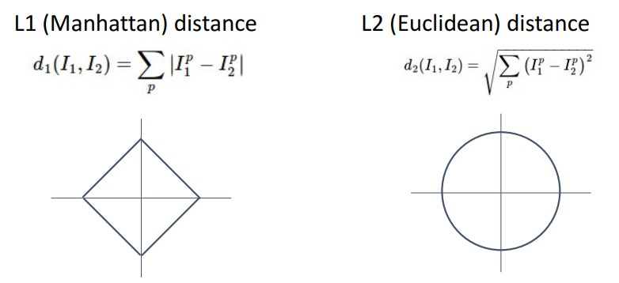
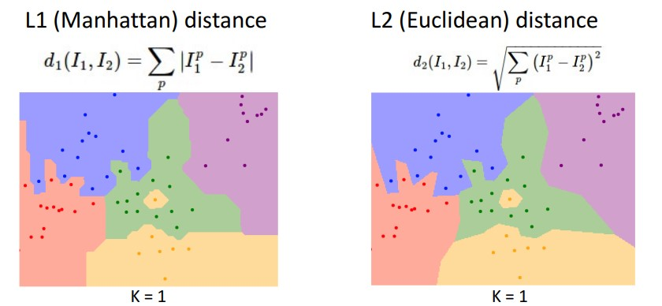

L1이 좀더 선이 수직/수평에 가까운 것을 볼 수 있다.

L2인가 L1인가를 선택하느냐에 따라 다른 그림이 나온다.

----

## Hyperparameters

learn하는 parameter가 아니고 사용자가 직접 지정해줘야하는 parameter를 의미한다. 

찾는 방법이 있기는 하나 효과적인 거는 없고, 시행착오가 거의 유일한 방법이다.

Hyperparameter를 setting할 때, K = 1로 놓으면 안된다.
항상 100%의 예측율로 작동하게 되기 때문이고, 또한 K를 올림으로써 Noise를 제거할 수 있는 건 여전하기 때문이다.

그래서 dataset을 train set과 test set으로 나눠서 train set을 통해 parameter를 정하고 test set에서 hyper parameter를 정한다.

그런데 이것도 좋은 방법이 아니다. test set을 참고하여 model을 점차 수정하게 되기 때문이다.

따라서 다음과 같이 train validation, test set을 따로 둔다.

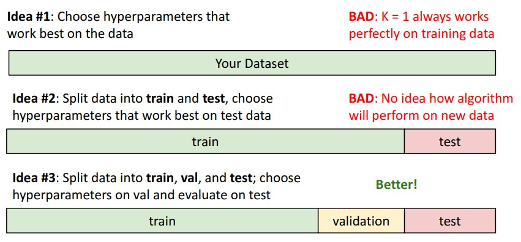

train은 parameter validation은 hyperparameter, test는 단 한번의 test를 위해 사용한다.

model이 작을 때와 data가 적을 때 좋다!

더 발전된 방법으로, k-fold dataset을 이용하는 것인데, data를 fold라는 이름의 덩어리로 나눠서 validation set을 교대로 사용하는 것이다.

----

아래 그림과 같이, 여러 실험을 통해 Accuracy와 hyper parameter로 그래프를 그려서 적합한 hyperparameter를 찾을 수 있다.

----

# K-neighbor Algorithm의 문제점

Neighbor은 입력 data를 늘리면
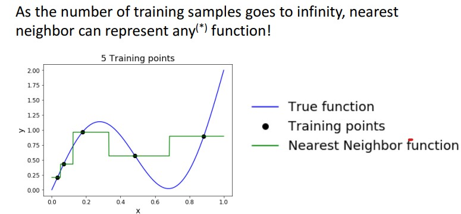

이런 식으로 실제함수와 동일해진다. 하지만... 그 계산양이 너무나도 많다.

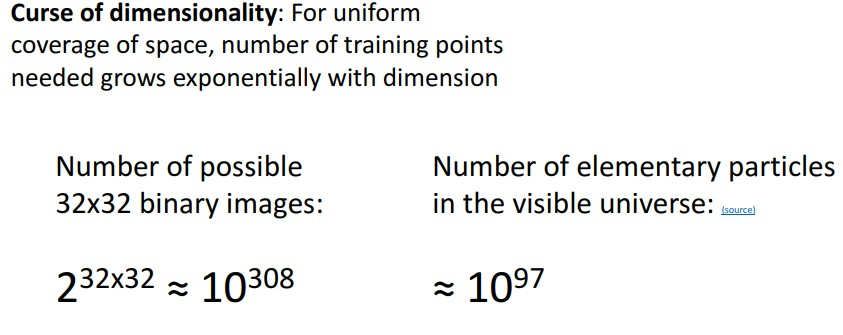

distance가 특정한 의미가 없다는 문제도 있다.

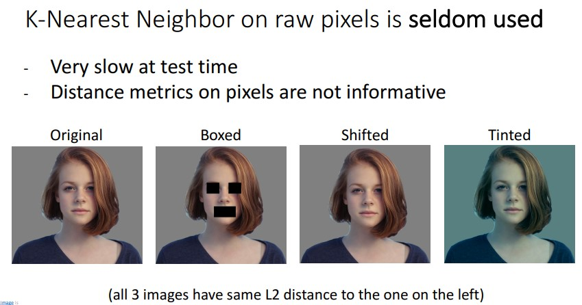

그래서 Convnet과 함께 사용해서 개선한다.

CNN에 의한 feature vector를 활용한다. -> image classification, image captioning 등

feature vector : 이미지의 곡선이 얼마인지 등 함축적 정보를 뽑아낸 것.
